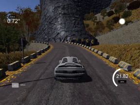

# Car Behavioral Cloning

|Track|
|:--------:|
||
|[YouTube Link](https://youtu.be/-YOy0YLsNuk)|

Final project of the following course: [Autonomous Cars: Deep Learning and Computer Vision in Python ](https://www.udemy.com/course/applied-deep-learningtm-the-complete-self-driving-car-course/)

The steps of the project consisted of:

- Gathering the dataset by using the udacity car [simulator](https://github.com/udacity/self-driving-car-sim)
- Preprocessing the images collected
- Using augmentation techniques (flipping, changing brightness, panning and zooming images) to increase the number of data
- Build a convolutional neural network to predict steering angles
- Train and validate the model with a training and a validation set
- Test that the model drives around the track without collisions

The model architecture used in this project was developed by the NVIDIA team and it is published [here](https://images.nvidia.com/content/tegra/automotive/images/2016/solutions/pdf/end-to-end-dl-using-px.pdf).